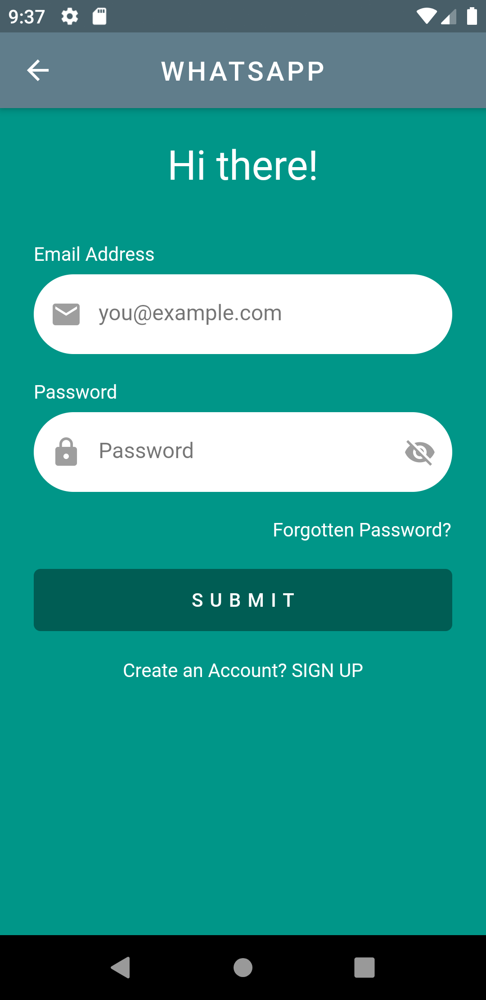
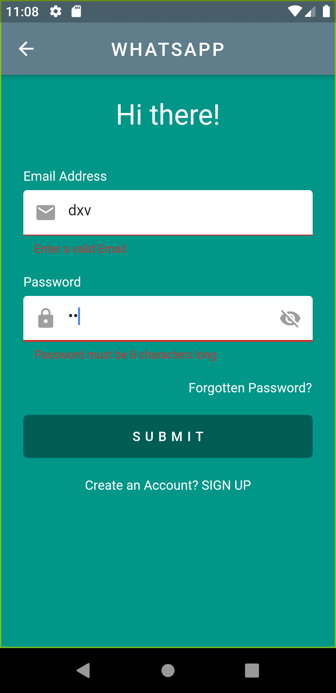

# Login-Page

* A new Flutter application to understand streams and bloc for state management.
* The application is a login page with no database management.
It just ensures correct feeding of email and password format on a login page.

## Screenshots:

  

    
  

  

    
  

 
